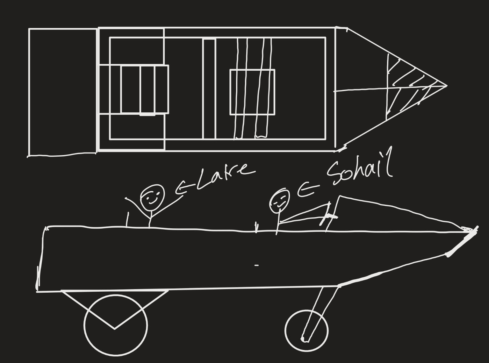
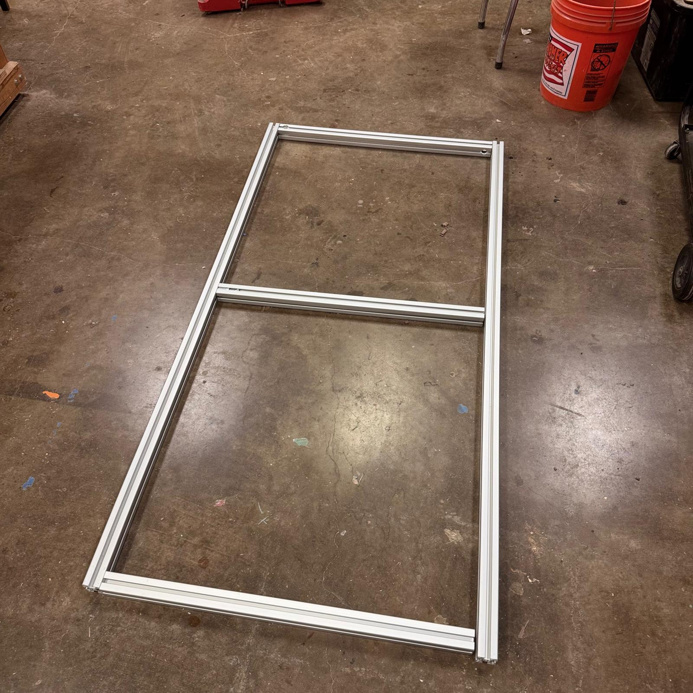
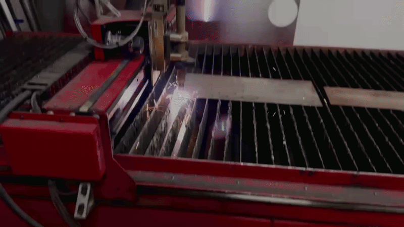
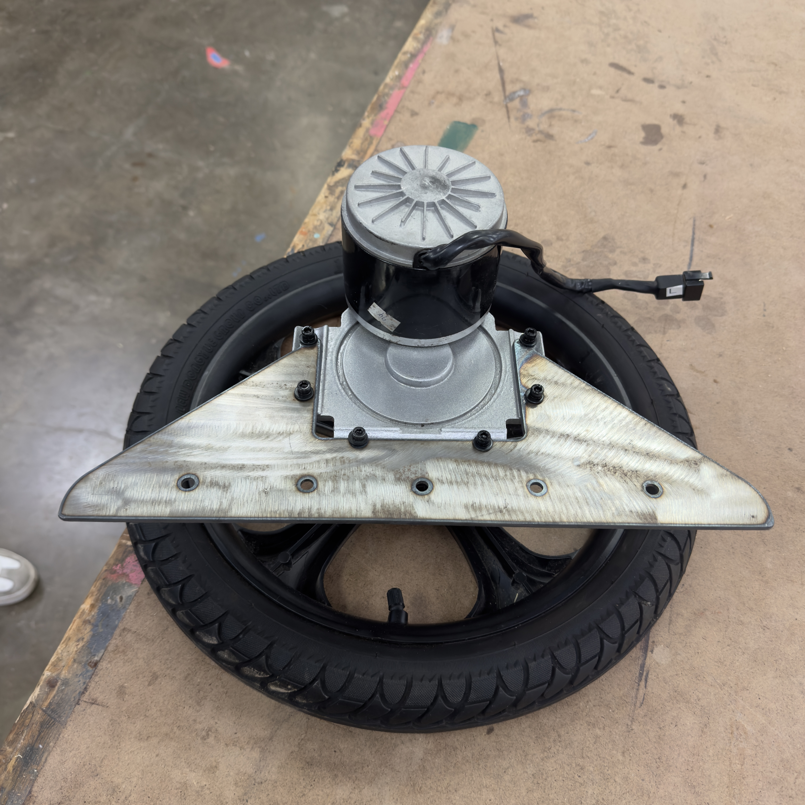
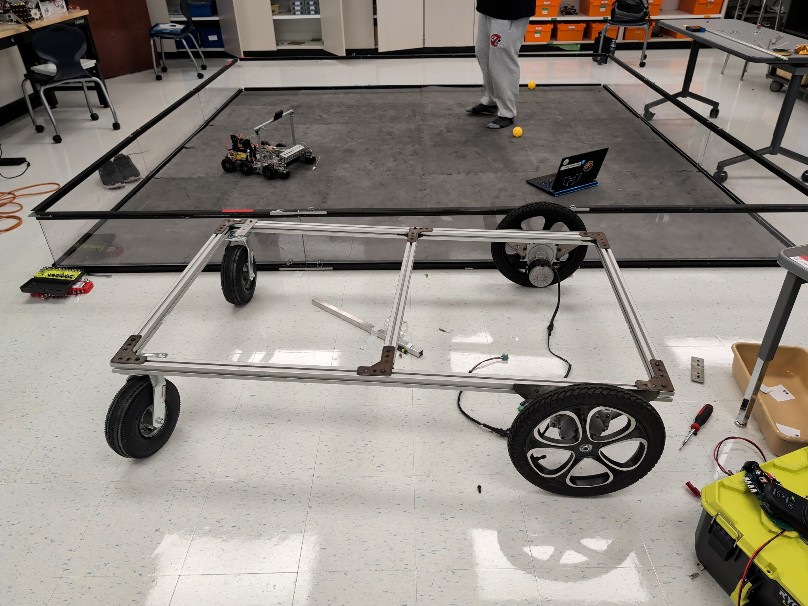
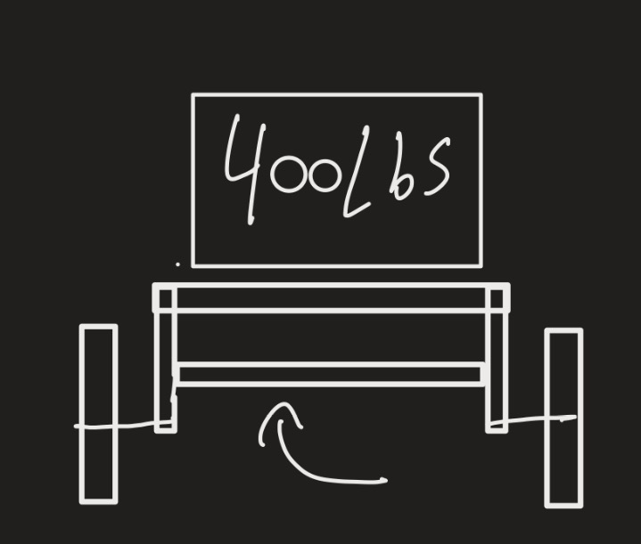
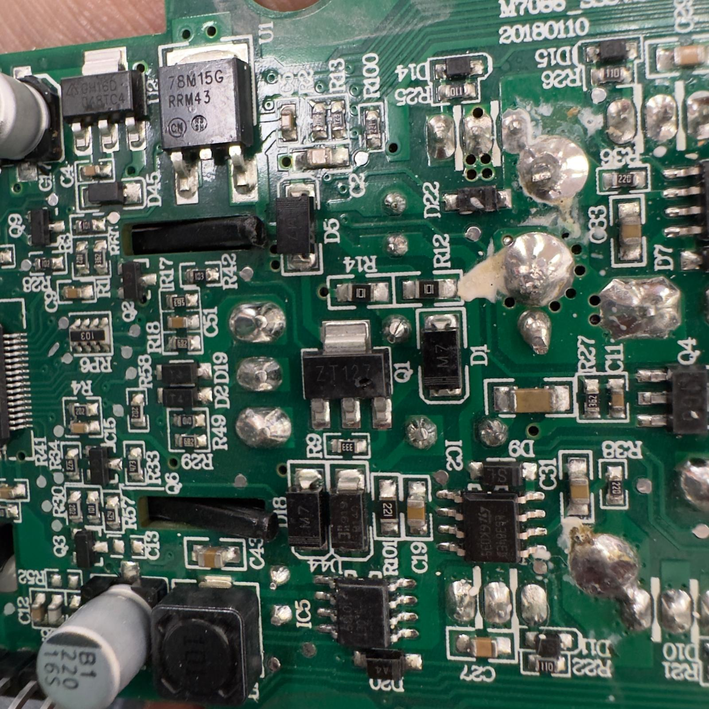
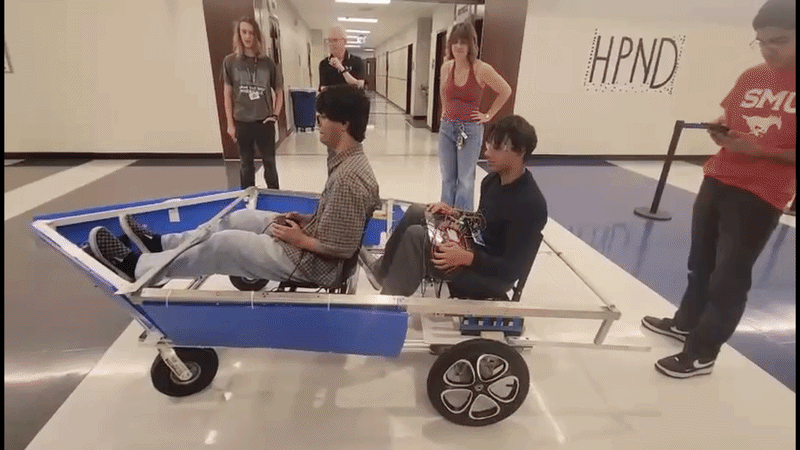

# Project: SpongeBob Boat

A budget build (under $250) using recycled and scrap parts, designed to resemble SpongeBob's boat while carrying one driver and one passenger a distance of 2 miles over varying inclines and declines.

# Design Requirements
- Total budget under $250
- Visual theme matching SpongeBob's boat
- Capacity for one driver and one passenger
- Must travel 2 miles over varying terrain grade (inclines and declines)

# Approach

The initial priority was structural: build a frame capable of safely supporting two riders and driving reliably, before addressing aesthetics. We began with a rectangular 40x40 aluminum extrusion frame reinforced with a center beam for added rigidity.

This design gave us a frame rigid enough to support two passengers (~400 lbs combined load). The frame was assembled using plasma-cut 90° brackets, slotted T-nuts, and M6 hardware throughout.

  

Motor brackets were plasma-cut from 1/8" mild steel to mount a recycled wheelchair motor — a 24V, 250W high-torque unit repurposed for propulsion.

  

At this stage, the chassis was fully assembled and structurally rigid.

  

One issue that emerged was **canting** — where the wheel angles outward under load, bending the mounting bracket over time.

  

The fix was a simple structural brace: adding a support bar between the two motor mounts. This tied the mounts together and significantly reduced canting under load.

  

## Powertrain and Electronics

Originally, we used the control unit salvaged from the wheelchair, but this proved unreliable — it produced constant errors and overheated under load.

  

Our fallback was the BTS7960 high-current motor driver. It was the perfect choice for this build due to its high current rating and low cost — rated for up to 43A, well above the ~20A per motor we see at max load.

  

# Control System Architecture

The boat's drive system is split into two main units: the **MDU (Motor Drive Unit)** on the boat itself, and the **OCU (Operator Control Unit)** used by the driver.

## MDU (Motor Drive Unit)

The MDU handles all propulsion and power delivery on board the boat:

- **Motors:** Two 250W 24V DC motors provide propulsion.
- **Motor Drivers:** Each motor is controlled by its own BTS7960 driver module, allowing independent speed and direction control per side (differential drive).
- **Battery:** A 24V 36Ah battery pack supplies power to both motors and the driver boards.
- **Controller:** An Arduino UNO reads control commands and sends PWM/direction signals to the two BTS7960 drivers, translating input into motor output.

## OCU (Operator Control Unit)

The OCU is the driver-facing control setup:

- A **Logitech gamepad** connects via **USB** to a laptop.
- The laptop reads gamepad input and sends drive commands to the Arduino UNO over **UART** (serial connection).

## Signal Flow

The laptop acts as the bridge between operator input and the motor control unit, translating joystick movement from the gamepad into serial commands that the Arduino interprets and forwards to the motor drivers.

  

## Testing

  

## Problems and Solutions
- During testing, the battery wires heated up due to the 40A draw. Switching from 14 AWG to 8 AWG wire resolved the overheating.
- Another unexpected issue: bundled wires were acting as an electromagnet. Separating the wires fixed this.
